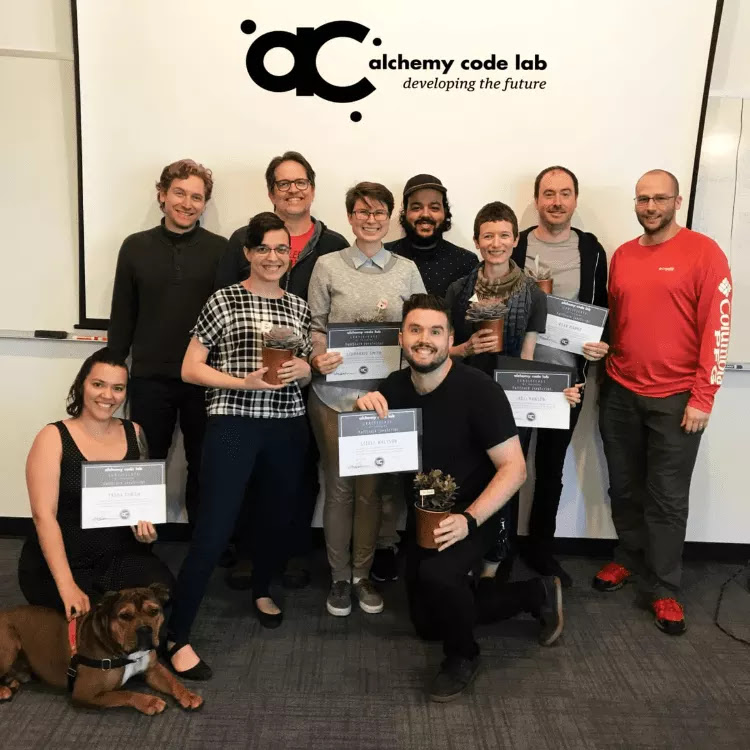

My career counselor was the first person to tell me that I should never call my code school a "Bootcamp," but she wasn't the last.  

"Call it 'Professional Training,' because that's what it is." She said. "If people hear 'Bootcamp,' you'll be dealing with immediate prejudice, and they'll miss what you bring to the table."

Google ["the problem with coding bootcamps"](https://www.google.com/search?ei=MF1sXKnQEp_ljwTt5Jb4BQ&q=the+problem+with+coding+bootcamps&oq=the+problem+with+coding+bootcamps&gs_l=psy-ab.3..0.851.2434..2594...0.0..0.935.2488.0j1j5-1j2......0....1..gws-wiz.......0i71._uLO328f3F0) and you'll get a wash of articles both claiming that bootcamps are all scams and flooding the industry with underqualified grads, and an equal number proclaiming that bootcamps are revolutionizing the face and culture of tech.  For people considering the bootcamp route to a career change, or hiring managers trying to gauge talent in a field constantly churning through labor, it is a confusing minefield right now.

A little over a year ago, I was firmly in the first camp.  Everything about a Bootcamp seemed perfect for my needs: a fast, but intensive course with a built-in networking component, that could leave me in a strong position to contribute to any team I join.  It seemed especially attractive compared with an alternative like a two-year CS degree.  If I wanted to be a frontend developer, did I need an Intro to Operating Systems course?  Probably not.  What about Discrete Mathematics?  Nope.  How about another $60,000 in student debt and two more years before I start my career?  You can see where I'm going, here.

Outside of the tech industry, a *Bootcamp* is an infamous experience, known for intensity as a mind and body transformation.  You enter Bootcamp as a chubby-cheeked, naive greenling, and leave a hard and powerful actor, fit for duty.  That's exactly what my tech Bootcamp did for me, except instead of leaving with a six pack, I gained 10 pounds and an amazing weath of knowledge about the language I studied (javaScript), TDD testing, fullstack architcecture, and how to hit the ground running on any team I walked into.

<caption>
My 2018 graduating cohort at Alchemy Code Lab, Portland OR
</caption>

*Inside* the tech industry, Bootcamp's reputation has been marred by the growing pains of a ad-hoc solution that grew too quickly in order and meet demand.  The existence of a large code school industry where there was none even 10 years ago, should be the first clue that the existing education solutions were flawed.  The early code schools were lambasted for producing devlopers with skill sets too narrow to adapt to real life work scenarios.  As these ill-equipped developers struggled, frustrated veterans– who had either the luck to graduate with a traditional CS degree, or their own hard-won pride invested in having "taught themselves" (a concept that is truly impossible)– started calling code school grads ["blue collar developers"](https://www.wired.com/2017/02/programming-is-the-new-blue-collar-job/), a phrase that cannot escape its own eliteism.

Those veterens were commenting on very real problems that the baby Bootcamp industry needed to address.  While there is a strong need for the industry to open up its talent pipeline, especially in cases of underrepresented demographics, there is no need to settle for sub-par talent.

What I've learned since graduation is that the Tech Industry is in dire need of a wake-up call.  I graduated in July of this year, and already had and heard of many conversations with people in hiring positions stressed about finding good talent for their companies.  Everyone wants the "Unicorn," the rare Senior Dev who is up on every cutting-edge language and architecture, but conservative and experienced enough to stick to efficient and scalable practices to keep the ship running at a clip.

I want to work with that the person, too.  I've had the honor of learning from a couple now, and each experience has a stong hand in shaping my progression in the industry.  I have only met these legends because they do not agree with the hiring managers I just referred to, because they know the fastest way to find more "Unicorns," is to start training them, right now.

There's nothing wrong with the lucky ones among us to achieve a Computer Science degree.  I've witnessed a lot of debate about the merits of difference degree programs, if the deep foundational knowledge is crucial or a waste of time... Those conversations remind me of similar debates regarding all higher education at the moment.

Just recently, an unnamed executive at my company called out my fellow Apprentice